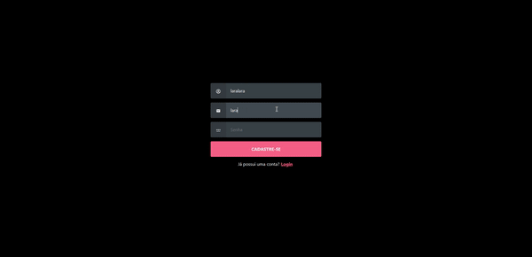
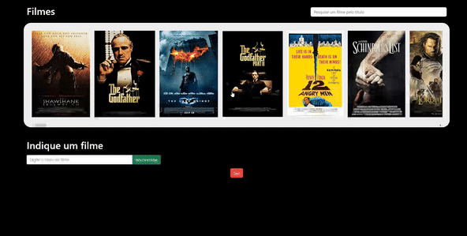

# Tech Challenge 3 - MovieFlix Plus

O MovieFlix Plus é um site desenvolvido utilizando as tecnologias React, Node.js e MongoDB. Ele oferece aos usuários a possibilidade de se registrarem e explorarem uma extensa lista de filmes. Os usuários podem marcar os filmes que já assistiram, remover seleções, realizar buscas e até mesmo sugerir novos filmes para serem adicionados à lista.

### Autenticação

### Aplicação

## Frontend
### Tecnologias Utilizadas
- **React + Vite**: O frontend é desenvolvido usando React como biblioteca principal e Vite como ferramenta de construção para uma experiência de desenvolvimento mais rápida.
- **JavaScript**: O projeto utiliza JavaScript para funcionalidades de script.

## Backend
### Tecnologias Utilizadas
- **Node.js**: O backend é construído usando Node.js, fornecendo um tempo de execução do lado do servidor escalável.
- **Express**: Express é utilizado como o framework de aplicação web para criar APIs robustas e escaláveis.
- **Mongoose**: Mongoose é utilizado para modelagem de objetos MongoDB, fornecendo uma maneira direta de interagir com o banco de dados MongoDB.

## Banco de Dados
- 3 bancos de dados:
  - **db1**: Banco de dados de autenticação.
  - **db2**: Banco de dados de filmes.
  - **db3**: Banco de dados de filmes assistidos por usuário.

### Gerenciamento do Banco de Dados
- **MongoDB**: MongoDB é o banco de dados NoSQL escolhido, proporcionando flexibilidade e escalabilidade para armazenar dados relacionados a usuários.

## Funcionalidades

### Autenticação
- **Registro e Login de Usuários**: Os usuários podem se registrar com nomes de usuário e e-mails exclusivos. A funcionalidade de login verifica credenciais usando bcrypt para uma comparação segura de senha.

### Recuperação de Senha
- **Esqueci a Senha**: Os usuários podem solicitar uma redefinição de senha via e-mail. Um token JWT é gerado e enviado para o e-mail do usuário usando o nodemailer.

### Segurança
- **Autenticação Baseada em Token**: Tokens JWT são utilizados para autenticação de usuário. Os tokens são armazenados como cookies para comunicação segura entre o frontend e o backend.

### Rotas Protegidas
- **Rota de Verificação de Usuário**: Uma rota protegida para verificar se o usuário possui um token válido em seus cookies.

### Logout do Usuário
- **Rota de Logout**: Os usuários podem fazer logout, removendo o token dos cookies.

### Filmes 
- **Rota de Filmes**: Permite usuário ver uma lista predefinida de 250 filmes.
- **Rota de Filmes Assistidos**: Permite usuário marcar os filmes assistidos e removê-los.
- **Rota de Filmes Sugeridos**: Permite usuário sugerir filmes que não estejam na lista.
- **Busca de Filmes**: Permite usuário buscar filmes da lista.

## Rotas da API (/auth)
- **/signup**: Permite que os usuários se cadastrem. Verifica a existência de usuários com base no e-mail e no nome de usuário. Usa bcrypt para criptografia de senha e salva os dados do usuário no banco de dados MongoDB.

- **/login**: Manipula o login do usuário. Compara o e-mail e a senha fornecidos com as credenciais armazenadas usando bcrypt. Se bem-sucedido, um token JWT com expiração de uma hora é salvo como um cookie.

- **/forgotPassword**: Rota para usuários que esquecem a senha. Gera um token JWT para redefinição de senha e o envia para o e-mail do usuário usando o nodemailer.

- **/resetPassword/:token**: Rota para redefinir a senha. Usa o token para extrair o ID do usuário e atualizar sua senha criptografada no banco de dados.

- **/verifyUser**: Rota para verificar se o usuário possui um token válido em seus cookies. Uma rota protegida.

- **/logout**: Rota para logout do usuário. Remove o token dos cookies.
 
## Rotas da API (/movies)
- **/getAll**: Retorna todos os filmes da API. Os dados dos filmes são mockados e armazenados no MongoDB. O esquema de dados pode ser encontrado [aqui](https://github.com/toedter/movies-demo/blob/master/backend/src/main/resources/static/movie-data/movies-250.json).

## Rotas da API (/watchedMovies)
- **/add**: Rota para adicionar um filme como assistido. Salva o user_id, movie_id, título do filme e poster. Verifica se o filme já foi marcado como assistido pelo usuário e caso contrário, salva no banco de dados.

- **/remove**: Rota para remover um filme de assistido. Procura pelo user_id e movie_id do banco de dados e remove caso exista o registro no banco.

- **/getByUserId/:user_id**: Rota para retornar todos os filmes assistidos pelo usuário fornecido no parâmetro.

## Rotas da API (/google)
- **/addRow**: Rota para adicionar um filme sugerido pelo usuário na planilha Google Sheets para que os administradores possam validar se o filme existe e adicionar no catálogo.

## Rodando o Projeto
Para experimentar o projeto MovieFlix Plus, siga estas instruções:

1) Pré-requisitos:
- Instale o Node.js: Certifique-se de ter o Node.js instalado em sua máquina. Você pode baixá-lo aqui.
- Instale o MongoDB: Instale o MongoDB em sua máquina e certifique-se de que esteja em execução. Você pode baixá-lo aqui.
- Configure a API do Google Sheets: Siga o Guia de Início Rápido da API do Google Sheets para ativar a API do Google Sheets e baixar o arquivo credentials.json. Salve este arquivo no diretório raiz do projeto.

2) Clone o repositório do MovieFlix Plus:
git clone [<repository_url>](https://github.com/laraberns/tech-challenge-3.git)

3) Instale as dependências para o frontend e o backend:
~~~
# Navegue até o diretório do frontend
    cd frontend
    npm install

# Navegue até o diretório do backend
    cd backend
    npm install
~~~

4) Variáveis de Ambiente
~~~
# Crie um arquivo .env no diretório backend com a configuração fornecida:
    MONGODBCONNECTION='mongodb://localhost:27017/authentication'
    MONGODBCONNECTIONMOVIES='mongodb://localhost:27017/movies'
    MONGODBCONNECTIONWATCHEDMOVIES='mongodb://localhost:27017/watchedmovies'
    KEY='yourkey'
    EMAIL='youremail'
    SENHAEMAIL1='yourpassword'
~~~

5) Executar o Projeto
~~~
Inicie o servidor backend:
    # Navegue até o diretório do backend
    cd backend
    # Execute o servidor
    npm start

Inicie o servidor frontend em um novo terminal:
    # Navegue até o diretório do frontend
    cd frontend
    # Execute o servidor
    npm run dev
~~~

6) Abra seu navegador e vá para http://localhost:5173 para acessar a aplicação MovieFlix Plus.

**Agora você pode explorar os recursos do MovieFlix Plus, incluindo autenticação de usuário, listagem de filmes, marcação de filmes como assistidos, sugestão de filmes e muito mais. Crie as suas credenciais para testar a autenticação e siga o fluxo da aplicação com base nos recursos descritos no documento Tech Challenge.**

